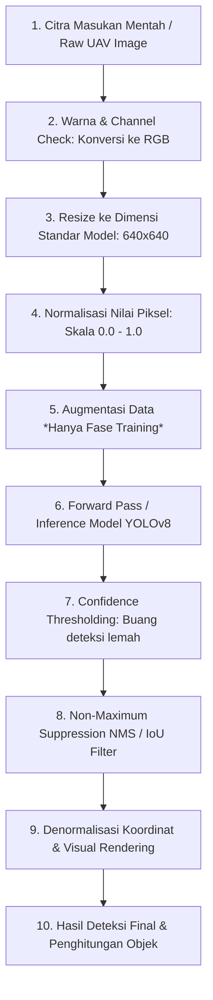

# Alur Pengolahan Citra: Deteksi & Klasifikasi Kesehatan Pohon Sawit (YOLOv8)

Dokumen ini menjelaskan tahapan pengolahan citra (*image processing*) langkah-demi-langkah (step-by-step) dari berkas citra mentah udara (UAV/drone) hingga menghasilkan output analisis akhir berupa jumlah dan klasifikasi kesehatan pohon sawit.

---

## Diagram Alur Pemrosesan Citra


---

## Penjelasan Tahapan Lengkap

### Langkah 1: Pembacaan & Penyelarasan Mode Warna (Input & Decoding)
Citra UAV/drone yang diunggah ke sistem atau dibaca oleh program bisa memiliki berbagai format warna, seperti:
* **Grayscale**: 1 Channel warna (L).
* **RGBA**: 4 Channel warna (memiliki channel transparansi/alpha).
* **RGB**: 3 Channel warna standar (Merah, Hijau, Biru).

**Proses Pengolahan Citra**:
Model pembelajaran mendalam YOLOv8 dirancang untuk menerima input tensor dengan format 3 channel (RGB). Oleh karena itu, sistem melakukan penyelarasan format warna:
* Jika citra masukan bertipe **Grayscale** atau **RGBA**, sistem secara paksa mengubahnya ke mode **RGB** (3 channel).
* Di dalam backend REST API (`ml-service/app.py`), proses ini ditangani menggunakan fungsi:
  ```python
  pil_image = Image.open(image_bytes).convert("RGB")
  ```

---

### Langkah 2: Standardisasi Resolusi (Image Resizing)
Citra mentah UAV umumnya memiliki resolusi tinggi (misal: `1024x1024` piksel atau lebih besar). Untuk memprosesnya di dalam jaringan saraf tiruan (neural network), ukuran gambar harus seragam.

**Proses Pengolahan Citra**:
* Citra diubah ukurannya (*resized*) menjadi resolusi standar input model, yaitu **`640x640` piksel**.
* Proses pengecilan ukuran ini membantu menyeimbangkan kecepatan komputasi (*inference speed*) dan detail spasial objek agar pohon sawit tetap dapat diidentifikasi secara jelas tanpa membebani memori GPU.
* Di dalam Python, proses ini dijalankan menggunakan pustaka PIL:
  ```python
  resized_image = pil_image.resize((640, 640))
  ```

---

### Langkah 3: Normalisasi Piksel & Konversi Tipe Data (Normalization)
Nilai piksel asli gambar digital berada pada rentang skala **`0` hingga `255`** (tipe data Integer 8-bit / `uint8`). 

**Proses Pengolahan Citra**:
* Agar proses pencarian bobot model selama training stabil dan gradient tidak meledak (*exploding gradient*), nilai piksel gambar dinormalisasi menjadi rentang desimal **`0.0` sampai `1.0`**.
* Seluruh piksel dibagi dengan angka pembagi desimal `255.0`, dan tipe datanya dikonversi dari integer ke desimal presisi tunggal (`float32`).
* Formula normalisasi:
  $$P_{norm} = \frac{P_{original}}{255.0}$$
* Di dalam Python:
  ```python
  normalized_array = np.asarray(resized_image, dtype=np.float32) / 255.0
  ```

---

### Langkah 4: Augmentasi Data Latih (Hanya Selama Fase Pelatihan Model)
Untuk melatih model agar tahan terhadap berbagai kondisi alamiah di perkebunan (perbedaan cahaya, guncangan drone, kabut), citra dimanipulasi secara visual sebelum diumpankan ke model.

**A. Augmentasi Eksternal (Albumentations)**:
Diterapkan sebelum data masuk ke sistem training YOLO untuk meningkatkan keanekaragaman dataset:
1. **Horizontal & Vertical Flip**: Membalik gambar secara horizontal (p=0.5) dan vertikal (p=0.3).
2. **RandomRotate90**: Memutar citra acak sebesar 90, 180, atau 270 derajat.
3. **RandomBrightnessContrast**: Mensimulasikan perubahan intensitas cahaya matahari (terang benderang atau berawan).
4. **GaussianBlur**: Mensimulasikan blur akibat getaran drone atau ketidakfokusan lensa.
5. **RandomFog**: Menyisipkan efek kabut buatan.

**B. Augmentasi Internal (YOLOv8)**:
Diterapkan langsung oleh mesin YOLOv8 saat training:
* **Mosaic (p=1.0)**: Menggabungkan 4 gambar berbeda menjadi 1 bidang mosaik baru, melatih model mengenali objek berukuran mikro.
* **Mixup (p=0.1)**: Menindih dua gambar latih berbeda dengan tingkat transparansi tertentu.
* **Close Mosaic**: Mematikan fitur mosaik pada 10 epoch terakhir pelatihan agar model fokus belajar mendeteksi pohon kelapa sawit asli tanpa gangguan batas/garis sambungan mosaik.

---

### Langkah 5: Inferensi Model (Inference / Forward Pass)
Citra berukuran `640x640` yang sudah dinormalisasi diumpankan ke arsitektur model YOLOv8 (Backbone $\rightarrow$ Neck $\rightarrow$ Head).

**Proses Pengolahan Citra**:
* Jaringan mengekstrak fitur gambar dan memprediksi ratusan kandidat kotak pembatas (*bounding box*) di seluruh area gambar.
* Setiap kotak pembatas membawa 6 informasi dasar:
  $$\text{Box} = [x_1, y_1, x_2, y_2, \text{Confidence Score}, \text{Class ID}]$$
  * $x_1, y_1, x_2, y_2$: Koordinat tepi kotak.
  * **Confidence Score**: Tingkat keyakinan model bahwa kotak tersebut berisi pohon sawit ($0.0 \sim 1.0$).
  * **Class ID**: Label klasifikasi objek (misalnya `0` untuk Sehat/Healthy, `1` untuk Bermasalah/Critical).

---

### Langkah 6: Confidence Thresholding (Pembersihan Deteksi Lemah)
Hasil prediksi mentah model menghasilkan sangat banyak kotak deteksi acak di latar belakang (misalnya pada semak-semak atau tanah kosong).

**Proses Pengolahan Citra**:
* Sistem menyaring dan membuang semua kotak deteksi yang memiliki skor keyakinan di bawah ambang batas (misal: $T_{conf} < 0.55$).
* Hanya prediksi yang kuat yang dipertahankan.

---

### Langkah 7: Non-Maximum Suppression (NMS / Eliminasi Deteksi Tumpang Tindih)
Satu pohon sawit sering kali dikelilingi oleh beberapa bounding box yang tumpang tindih karena model mendeteksi pola yang sama berulang kali di area tersebut.

**Proses Pengolahan Citra**:
* Menggunakan algoritma **NMS** untuk menyisakan satu kotak terbaik per pohon sawit.
* Langkah-langkah NMS:
  1. Urutkan semua kotak tersisa dari skor confidence tertinggi ke terendah.
  2. Ambil kotak dengan confidence tertinggi, simpan sebagai deteksi final.
  3. Hitung nilai **Intersection over Union (IoU)** dengan kotak-kotak lainnya.
     $$IoU = \frac{\text{Area of Overlap (Irisan)}}{\text{Area of Union (Gabungan)}}$$
  4. Jika nilai $IoU$ melebihi ambang batas (misal: $IoU \ge 0.4$), maka kotak lain tersebut dianggap sebagai duplikat dari pohon sawit yang sama dan langsung **dihapus**.
  5. Ulangi proses hingga semua kotak terproses.

---

### Langkah 8: Denormalisasi & Pemetaan Visual (Visualization & Output)
Agar kotak pembatas dapat digambar dengan presisi pada gambar berdimensi asli, koordinat prediksi yang semula dinormalisasi ($0.0 \sim 1.0$) harus dikonversi kembali ke koordinat piksel gambar asli.

**Proses Pengolahan Citra**:
* **Denormalisasi**: Koordinat dikalikan kembali dengan lebar ($img\_w$) dan tinggi ($img\_h$) citra asli sebelum di-resize.
* **Visual Rendering**: Menggambar kotak pembatas menggunakan warna penanda status kesehatan:
  * **Hijau**: Status *Healthy* (Sehat/Normal).
  * **Merah**: Status *Critical/Warning* (Menguning/Mati/Terbakar).
* **Penghitungan**: Menghitung total kemunculan kotak per kelas warna untuk disajikan sebagai hasil statistik analisis kesehatan perkebunan kelapa sawit secara riil.
